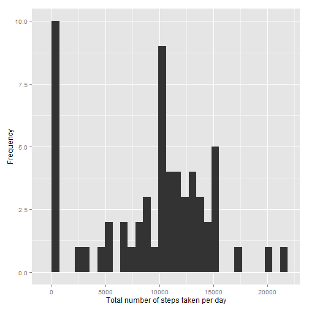
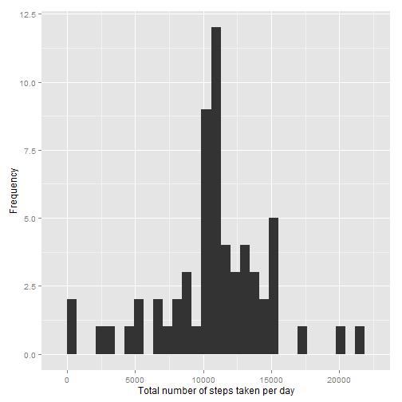

# Reproducible Research: Peer Assessment 1
This is the first assignment of the course *Reproducible Research* of *Coursera*.

This assignment makes use of data from a personal activity monitoring device. This device collects data at 5 minute intervals through out the day. The data consists of two months of data from an anonymous individual collected during the months of October and November, 2012 and include the number of steps taken in 5 minute intervals each day.

## Loading and preprocessing the data
Firstly data is read from the .csv file supplied.

```r
unzip("activity.zip")
data <- read.csv("activity.csv")
```


## What is mean total number of steps taken per day?
In order to answer this question, the number of steps are summed for each day. If all data of a day is *NA*, it is assumed that zero steps were taken that day. 

```r
date.sum <- tapply(data$steps, data$date, sum, na.rm = T)
```


The histogram that represents the total number of steps taken per day is shown below.

```r
require(ggplot2)
```

```
## Loading required package: ggplot2
```

```r
qplot(date.sum, xlab = "Total number of steps taken per day", ylab = "Frequency")
```

```
## stat_bin: binwidth defaulted to range/30. Use 'binwidth = x' to adjust this.
```

 


The average of the total number of steps taken per day is:

```r
mean(date.sum)
```

```
## [1] 9354
```

The median of the total number of steps taken per day is:

```r
median(date.sum)
```

```
## [1] 10395
```


## What is the average daily activity pattern?
Now, the average value of steps taken in each interval, averaged across all days is calculated. *NA* values will be ignored for the moment.

```r
interval.avg <- aggregate(steps ~ interval, mean, data = data)
```


The following plot represents these values.


```r
qplot(interval, steps, data = interval.avg, geom = "line")
```

 


The maximun value is reached in this interval:

```r
interval.avg[which.max(interval.avg$steps), "interval"]
```

```
## [1] 835
```


## Imputing missing values
The total number of missing values in the dataset is:

```r
sum(is.na(data$steps))
```

```
## [1] 2304
```


These *NA* values are going to be filled with the mean for each 5-minute interval.

```r
data2 <- data
for (i in 1:nrow(data)) {
    if (is.na(data[i, "steps"])) {
        data2[i, "steps"] <- interval.avg[interval.avg$interval == data[i, "interval"], 
            "steps"]
    }
}
```


The same statistics that were shown above are shown for the new dataset. 
The histogram that represents the total number of steps taken per day is shown below.

```r
date2.sum <- tapply(data2$steps, data2$date, sum, na.rm = T)
qplot(date2.sum, xlab = "Total number of steps taken per day", ylab = "Frequency")
```

```
## stat_bin: binwidth defaulted to range/30. Use 'binwidth = x' to adjust this.
```

 


The average of the total number of steps taken per day is:

```r
mean(date2.sum)
```

```
## [1] 10766
```

The median of the total number of steps taken per day is:

```r
median(date2.sum)
```

```
## [1] 10766
```


As it can be seen, both the mean and the median has been increased and are equal now.

## Are there differences in activity patterns between weekdays and weekends?
First, a new factor variable indicating whether a given date is a weekday or a weekend day is created in the dataset.

```r
Sys.setlocale(category = "LC_TIME", locale = "C")
```

```
## [1] "C"
```

```r
data2$type.date <- as.factor(ifelse(weekdays(as.Date(data2$date), abbreviate = T) %in% 
    c("Sat", "Sun"), "weekend", "weekday"))
```


```r
interval2.avg <- aggregate(steps ~ interval + type.date, mean, data = data2)
qplot(interval, steps, data = interval2.avg, geom = "line", facets = type.date ~ 
    .)
```

 

